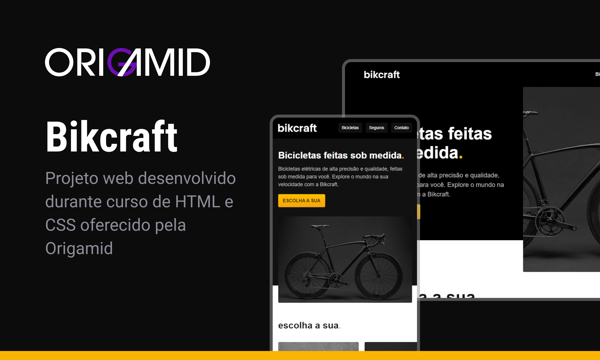

<h1 align="center"> Bikcraft </h1>

Projeto desenvolvido durante curso de UI Design e HTML e CSS da Origamid.
 
<a href="https://www.origamid.com/curso/ui-design-para-iniciantes/">Estude esse projeto em formato de vídeo clicando aqui.</a>

  <a href="#-tecnologias">Tecnologias</a>&nbsp;&nbsp;&nbsp;|&nbsp;&nbsp;&nbsp;
  <a href="#-projeto">Projeto</a>&nbsp;&nbsp;&nbsp;|&nbsp;&nbsp;&nbsp;
  <a href="#-layout">Layout</a>&nbsp;&nbsp;&nbsp;|&nbsp;&nbsp;&nbsp;
  <a href="#memo-licença">Licença</a>

  

 

  

## 🚀 Tecnologias

Esse projeto foi desenvolvido com as seguintes tecnologias:

- HTML e CSS
- JavaScript
- Git e Github
- Figma

## 💻 Projeto

O Bikcraft é um site de vendas de bicicletas online fictício.

- [Acesse o projeto finalizado, online](https://diegoespelho.github.io/bikcraft)

- [Assistir aulas](https://img.shields.io/static/v1?label=license&message=MIT&color=49AA26&labelColor=000000)

## 🔖 Layout

O layout desse projeto foi todo executado utilizando a ferramenta Figma, durante curso de UI Design da Origamid.

## 📝 Licença

Esse projeto está sob a licença MIT.

---

Feito com ♥ by Origamid 🐺
